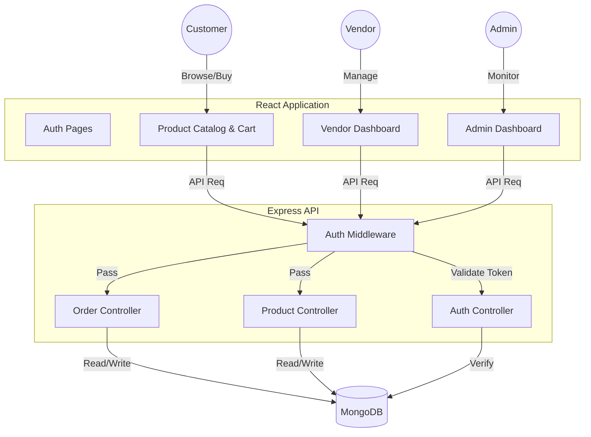

# 🛒 ShopEase: Multi-Vendor E-Commerce Ecosystem

## 📖 Project Overview

**ShopEase** is a comprehensive, production-ready e-commerce solution designed to bridge the gap between multiple vendors and customers in a unified marketplace. Built on the **MERN Stack (MongoDB, Express, React, Node.js)**, it functions as a scalable platform where:
- **Vendors** can manage their own storefronts, inventory, and order fulfillment independently.
- **Customers** enjoy a seamless shopping experience with advanced filtering, secure cart management, and real-time order tracking.
- **Admins** maintain total oversight of the platform, ensuring quality control through vendor and return approvals.

This project goes beyond simple CRUD operations to implement complex business logic including **multi-stage order workflows** (Processing → Packed → Shipped → Delivered), **strict return policies** (Admin Approval → Vendor Initiation → User Handover → Refund), and **role-based security**.

---

## 🌟 Key Features & Capabilities

### 🛍️ For Customers (The Shopping Experience)
*   **Smart Product Discovery**:
    *   Dynamic Search with real-time filtering by Category, Price Range, and Ratings.
    *   Responsive Grid Layouts for easy browsing on any device.
*   **Secure Cart & Checkout**:
    *   Persistent cart management.
    *   Multi-step checkout process with address selection.
    *   Order Summary with tax and shipping calculations.
*   **Advanced Order Tracking**:
    *   Visual progress bars for Order Status (e.g., "Out for Delivery").
    *   **Return/Exchange Interface**: A dedicated modal to request returns with specific reasons and image evidence options.
    *   **Real-time Refund Updates**: View refund status and amounts immediately upon processing.

### 🏪 For Vendors (The Seller Dashboard)
*   **Comprehensive Analytics Dashboard**:
    *   **Visual Charts (Recharts)**: Line charts for Sales Trends, Pie charts for Category Distribution, and Bar charts for Top Products.
    *   **Key Metrics**: Real-time calculation of Total Revenue, Orders, and Active Products.
*   **Inventory Management**:
    *   Rich-text product editors.
    *   Image handling with multiple uploads.
    *   Stock level tracking with "Low Stock" alerts.
*   **Order Fulfillment Workflow**:
    *   Granular status updates: Vendors click through `Pack` -> `Ship` -> `Deliver`.
    *   **Return Handling**: Unique workflow to "Initiate Return Pickup" and "Mark as Returned" to trigger refunds.

### 🛡️ For Admins (Platform Control)
*   **Global Oversight**:
    *   User & Vendor User management (Ban/Unban capabilities).
    *   Platform-wide sales reports.
*   **Quality Control**:
    *   **Vendor Approval System**: New vendors require admin verification before selling.
    *   **Return Request Moderation**: Admins review customer return requests, accepting or rejecting them based on policy.

---

## 🏗️ Technical Architecture

The application follows a **Monolithic Architecture** with a clear separation of concerns (MVC Pattern in Backend, Component-Based in Frontend).

### 🖥️ Frontend (Client-Side)
*   **Core**: React.js 18 with Vite for lightning-fast builds.
*   **State Management**: React Context API for Global Auth and Cart state; Local state for UI controls.
*   **Routing**: React Router DOM v6 with protected routes (Role-Based Access Control).
*   **Styling**: Tailwind CSS for a utility-first, responsive design system.
*   **HTTP Client**: Axios with Interceptors for token handling.

### ⚙️ Backend (Server-Side)
*   **Core**: Node.js & Express.js.
*   **Database**: MongoDB Atlas with Mongoose ODM for strict schema modeling.
*   **Authentication**:
    *   **JWT (JSON Web Tokens)**: Stateless authentication.
    *   **Bcrypt.js**: Secure password hashing.
*   **File Storage**: Multer for handling multi-part form data (Images).
*   **Security**:
    *   **CORS**: Configured for secure cross-origin requests.
    *   **Dotenv**: Environment variable management.
    *   **Middleware**: Custom `authMiddleware` for protecting routes based on roles (`admin`, `vendor`, `user`).

### 🔄 Data Flow Diagram



---

## 📂 Project Structure

```bash
shopping-app/
├── backend/                # Server-Side Implementation
│   ├── CONTROLLERS/        # Business Logic (Order, Product, User, Vendor)
│   ├── MODELS/             # Mongoose Schemas & Data Validation
│   ├── ROUTES/             # API Endpoint Definitions
│   ├── MIDDLEWARES/        # JWT Verification & Error Handling
│   ├── CONFIG/             # Database Connection Setup
│   └── server.js           # Server Entry Point
│
└── frontend/               # Client-Side Implementation
    ├── src/
    │   ├── api/            # Centralized API Calls
    │   ├── components/     # Reusable UI (Cards, Modals, Navbar)
    │   ├── context/        # Global State Providers
    │   ├── pages/
    │   │   ├── admin/      # Admin-specific Views
    │   │   ├── vendor/     # Vendor-specific Views (Analytics, Orders)
    │   │   └── customer/   # Public Views (Home, Checkout, Profile)
    │   └── App.jsx         # Main Router & Layouts
    └── vite.config.js      # Build Configuration
```

---

## 🚀 Getting Started

### Prerequisites
*   Node.js (v16 or higher)
*   MongoDB (Compass or Atlas generic URI)

### 1. Clone the Repository
```bash
git clone https://github.com/athul457/shop-app.git
cd shop-app
```

### 2. Backend Setup
```bash
cd backend
npm install

# Create a .env file in the backend folder
echo "PORT=3000" > .env
echo "MONGO_URI=mongodb+srv://<your-db-uri>" >> .env
echo "JWT_SECRET=your_super_secret_key" >> .env

npm start
```
*The server will start on `http://localhost:3000`*

### 3. Frontend Setup
```bash
cd ../frontend
npm install
npm run dev
```
*The application will launch on `http://localhost:5173`*

---

## 🔮 Future Roadmap
*   **Payment Gateway**: Integration with Stripe/Razorpay for real payments.
*   **Email Notifications**: Automated emails for order status updates using Nodemailer.
*   **Reviews & Ratings**: Allow customers to rate products and vendors.
*   **Dark Mode**: System-wide theme toggling.
